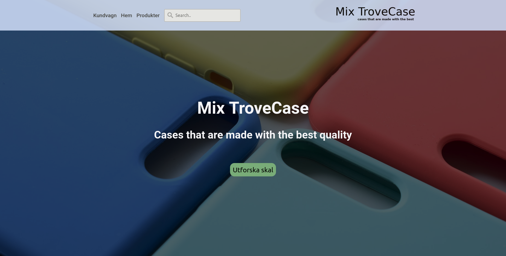
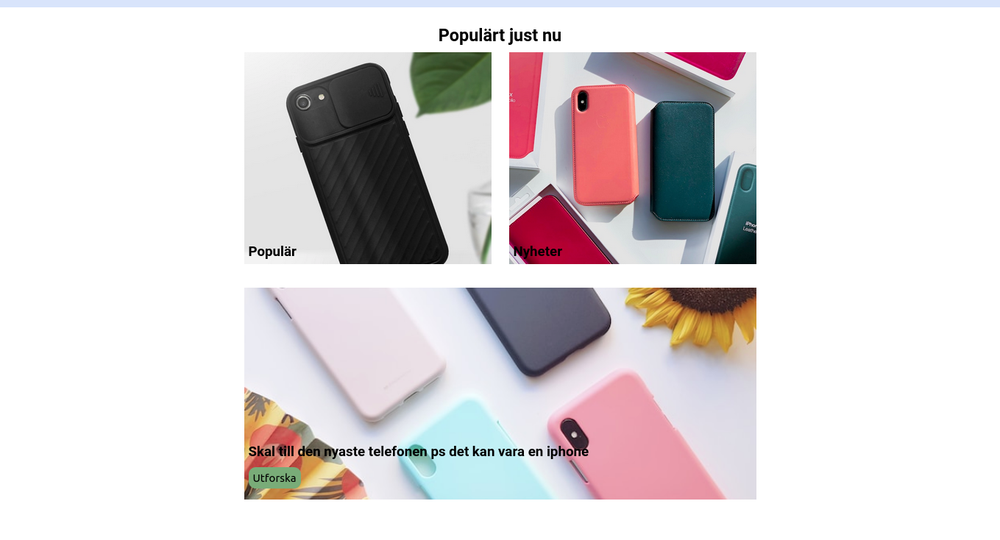
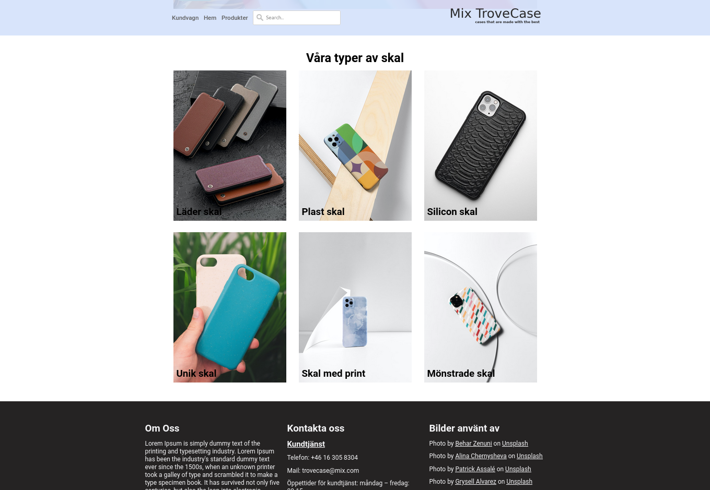

# Webbshop mobilskal 
Skaparen: Tim Fagerdal 

PM Skriven: 2023 - 10 - 24

Grupp: Team Tim, Tim, Pim

Backend repo: https://github.com/TE4-Umea/mobilskal-database

## Arbetsuppgiften 
Att göra en webbshop med temat av jobba med mobilskal. 
Vi skulle arbeta i grupp av 3, samt använda oss av en databas för att producera information på sidan. Databasen skulle arbetas i grupp för att ha en gemensam backend och sidan skulle använda sig av React för en individuell frontend. 
Det som skulle inkluderas på sidan:

* En design 
* Landing/front page
* Product page
* En kundvagn 
* Loga
* Call to action 

I databasen skulle det finnas:

* Spara information 
* Kunna skapa data
* Göra en API för att hämta datan ifrån

## Hur löstest arbetsuppgiften

### Backend 
Databasen gjordes i grupp och använde sig av Prisma, som är ett ORM (Object Relational Mapping), för att enklare gör ett databas skema samt göra ändringar i skemat. Man kan också göra kopplingar mellan olika tabeller enklare med Prisma. I koden under kan man see denna typen av koppling som Prisma hjälper med att göra, mellan categories, CategoriesOnProducts och Category kan man see kopplingen.

```
model Product {
  id          Int                    @id @default(autoincrement())
  name        String                 @unique
  picture     String
  description String
  categories  CategoriesOnProducts[]
  price       Int
  brand       Brand[]
  phonemodel  PhoneModel[]
}

  model Category {
  id       Int                    @id @default(autoincrement())
  name     String                 @unique
  products CategoriesOnProducts[]
}

model CategoriesOnProducts {
  product    Product  @relation(fields: [productId], references: [id])
  productId  Int
  category   Category @relation(fields: [categoryId], references: [id])
  categoryId Int
  assignedAt DateTime @default(now())

  @@id([productId, categoryId])
}

```


Databasen är en mysql databas som är lokalt sparad med localhostad från sin dator. Sedan kallas och sparas all data som skapar i backenden på sin mysql databas. I backenden skapas datan med följande kod:

```
const { PrismaClient } = require('@prisma/client')

const prisma = new PrismaClient()

async function main() {
    for (i = 0; i < 100; i++) {
        const product = await prisma.product.create({
            data: {
                name: `Product ${i + 1}`,
                description: 'This is a shell',
                price: Math.floor(Math.random() * (400 - 90) + 90),
                picture: `${Math.floor(Math.random() * (5 - 1) + 1)}.jpg`,
                brand: {
                    create: {
                        brand: 'apple',
                    }
                },
                phonemodel: {
                    create: {
                        phoneModel: `iPhone ${i + 1}`,
                    }
                },
                categories: {
                    create: [
                        {
                            category: {
                                connectOrCreate: {
                                    create: {
                                        name: 'Plast',
                                    },
                                    where: {
                                        name: 'Plast',
                                    },
                                },
                            },
                        },
                        {
                            category: {
                                connectOrCreate: {
                                    create: {
                                        name: 'Magnet',
                                    },
                                    where: {
                                        name: 'Magnet',
                                    },
                                },
                            },
                        },
                    ],
                },
            },
        })
    }
}

main()
    .then(async () => {
        await prisma.$disconnect()
    })

    .catch(async (e) => {
        console.error(e)

        await prisma.$disconnect()

        process.exit(1)
    })
```

Datan skapas till dem olika spalterna från tabellerna och gör i en for loop för att ha mycket test data.

När backenden blir kallad på körs följande kod:
```
const express = require('express')
const app = express()
const cors = require('cors')
const { PrismaClient } = require('@prisma/client')
const prisma = new PrismaClient()

app.use(cors())

app.get('/product', async function (req, res) {

    const { page = 1, perPage = 9 } = req.query

    const allProducts = await prisma.Product.findMany({
        skip: (Number(page) - 1) * Number(perPage),
        take: Number(perPage),
        include: {
            categories: true,
            brand: true,
            phonemodel: true
        }
    })

    let errors = []

    if (!allProducts) {
        error.push({
            message: 'No products found'
        })
    }

    res.json({
        errors: errors,
        data: allProducts,
    })
})

app.get('/product/:id', async function (req, res) {
    const productId = req.params.id
    try {
        const product = await prisma.Product.findUnique({
            where: {
                id: Number(productId),
            },
            include: {
                categories: true,
                brand: true,
                phonemodel: true
            },
        })
        res.json({
            data: product,
        })
    } catch (error) {
        console.log(error)
        res.json({
            error: error,
        })
    }
})

app.listen(3000)
```

Den gör en API på locholhost 3000 som vi använder i våra frontends.

"Get /product": Hämtar products data och ger 9 data arrayer som. Samt finns det error fångare som kollar om det inte finns nå data eller om andra errors dyker up. 

"Get /product/:id": Gör samma sak som product men det är för en specific product i databasen som beror på vilket id som skickas.

### Frontend 
Sidan gjordes med Vite React för att ha en bra arbetsmiljö som uppdateras varje gång man gör ändringar och spara dem i filerna. Samt har React bra verktyg för att upp datera sidan i realtid om någon typ av ändring händer på grund av funktioner. Vi använder också Routes för att kuna länga sidor ihop så man lan navigera mellan dem olika pages som skapas. Context använder också för att skicka information mellan pagerna, exempel för karten används context för att skicka information från shell att man vill köpa någon thing. Då placeras det i karten.

Koden under används för att göra kallelser från frontend till backend APIet, som ger frontend datan:

```
    const [data, setData] = useState([])

    async function fetchData() {
        await fetch('http://localhost:3000/product')
            .then(res => res.json())
            .then(result => {
                setData(result)
                console.log(result)
            }).catch(err => {
                console.log(err)
            })
    }

    useEffect(() => {
        fetchData()
    }, [])
```

## Vad gick bra och vad jag lärde mig
Det gick bra att utföra designen utifrån den jag gjorde i [figma](https://www.figma.com/file/EZMrltESFGoXsBo84yrbBf/telefon-skal?type=design&node-id=0%3A1&mode=design&t=PKpeluu6nNiYHXlO-1)
samt lärt mig smidigare sätt att skriva css med att använda grund classer i en root css. 







Det gick bra att kuna printa ut flera produkt kort i products beroende på hur många som blir kallad på från fetch kallelsen. Som gjorde mig mer bekväm med att använda React.

## Vad gick sämre och behöver lära/göra 
Jag hade problem med att använda context och förstå mig på hur man ska använde den. För i nu läget kan jag använde den men jag är inte bekväm med att använda den. Jag känner mig inte häller bekväm med att använda tabells i prisma och hur man gör ändringarna med den. Jag kan inte rickigt läsa av vad tabellerna betyder och hur dem är kopplad på ett smidigt sätt. 